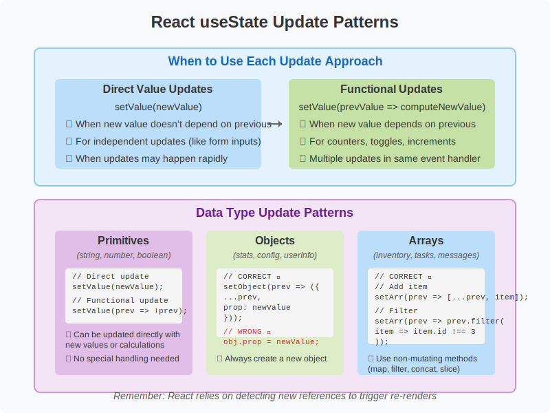

# React useState Hook Deep Dive: Adventure Game

This repository contains the code example from our React `useState` hook deep dive session. The Adventure Game demonstrates fundamental React state concepts in a fun, interactive way.

## 📹 Lecture Recording

You can watch the full lecture explaining these concepts on Google Drive:

[Link to Lecture Recording](https://drive.google.com/YOUR_VIDEO_LINK)

## 🎮 The Adventure Game Example

This simple example illustrates key React state concepts:

- Basic `useState` usage with various data types (strings, numbers, booleans, objects, arrays)
- Proper state update patterns
- Functional updates vs direct value updates
- Immutability with objects and arrays
- State batching

## 🚀 Getting Started

Follow these steps to run the project locally:

1. Clone this repository:

   ```bash
   git clone https://github.com/YOUR_USERNAME/react-useState-adventure-game.git
   cd react-useState-adventure-game
   ```

2. Install dependencies:

   ```bash
   npm install
   # or with pnpm
   pnpm install
   ```

3. Start the development server:

   ```bash
   npm run dev
   # or with pnpm
   pnpm dev
   ```

4. Open your browser and navigate to `http://localhost:5173/`

## 🔍 Exploring the State with React Developer Tools

For a better understanding of how React state works, install the **React Developer Tools** extension for your browser:

- [React Developer Tools for Chrome](https://chrome.google.com/webstore/detail/react-developer-tools/fmkadmapgofadopljbjfkapdkoienihi)
- [React Developer Tools for Firefox](https://addons.mozilla.org/en-US/firefox/addon/react-devtools/)

Once installed:

1. Open your browser's developer tools (F12 or right-click > Inspect)
2. Find the "Components" tab (you may need to click on >> to find it)
3. Select the AdventureGame component
4. Observe how the state changes as you interact with the application

## 📊 Lecture Overview



This diagram provides a visual summary of the key concepts covered in the lecture.

## 🧠 Key Concepts Explained

### The Two Ways to Update State

```jsx
// 1. Direct Value Update - Simple but can lead to stale state issues
setLevel(level + 1);

// 2. Functional Update - Safer when the new state depends on the previous state
setLevel((prevLevel) => prevLevel + 1);
```

### Immutability with Objects and Arrays

```jsx
// Updating objects the right way:
setStats((prevStats) => ({
  ...prevStats, // Copy all existing properties
  agility: prevStats.agility + 1, // Override just what you want to change
}));

// Updating arrays the right way:
setInventory((prevInventory) => [...prevInventory, "New Item"]);
```

## 📑 Additional Resources

- [React Official Documentation on useState](https://react.dev/reference/react/useState)
- [React Official Documentation on Updating Objects in State](https://react.dev/learn/updating-objects-in-state)
- [React Official Documentation on Updating Arrays in State](https://react.dev/learn/updating-arrays-in-state)
